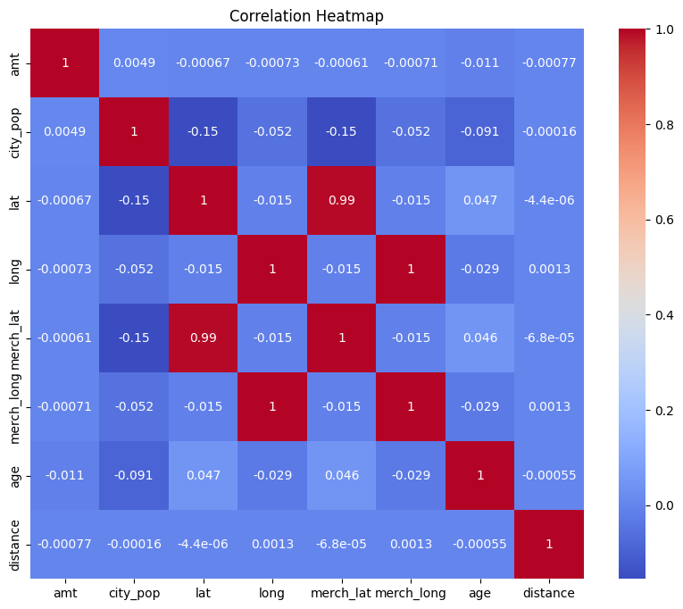
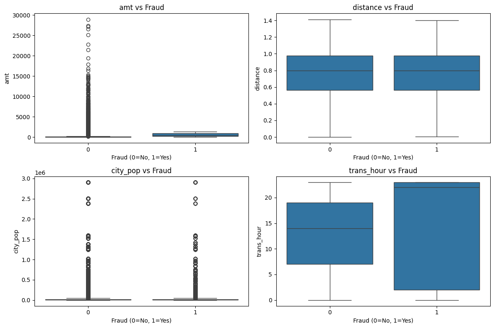

## Bivariate Analysis (Relationship Between Two Variables)

Common Combinations:

- Numerical vs Numerical (Correlation, Scatter Plot)
- Categorical vs Numerical (Grouped mean, Boxplot by category, ANOVA)
- Categorical vs Categorical (Crosstab, Chi-sware test, stacked bar chart)

It helps us to answer "what influences what or how they interact with each other? "

### Numerical vs Numerical

- Correlation matrix
  - `amt`
  - `city_pop`
  - `lat`
  - `long`
  - `merch_lat`
  - `merch_long`
  - `unix_time`

    

> **Interpretation**: Most numerical variables show near-zero correlation with transaction amount, indicating that transaction value is largely independent of geographic location, customer age, and city population.

### Numerical vs Target

- Transaction amount vs fraud
  - `amt` vs `is_fraud`
- Distance vs fraud
  - `distance` vs `is_fraud`
- Population vs fraud
  - `city_pop` vs `is_fraud`
- Transaction hour vs fraud
  - `hour` vs `is_fraud`

> **Signal**:
> trans_hour → strongest signal
> amt → moderate signal
> distance → weak signal
> city_pop → almost no signal

> **Interpretation**:
>
> - Transaction Hour (trans_hour) – Fraud transactions appear more concentrated during late hours, showing the clearest difference from normal transactions.
> - Transaction Amount (amt) – Fraud tends to occur at moderately higher amounts, though legitimate transactions contain more extreme outliers.
> - Distance (distance) – Fraud and non-fraud distributions are very similar, suggesting distance alone is a weak indicator.
> - City Population (city_pop) – Shows almost no difference between fraud and non-fraud, indicating little relationship with fraud occurrence.
